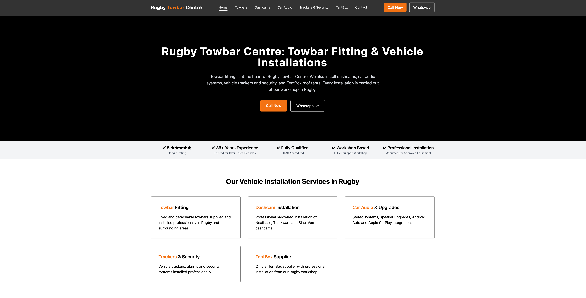
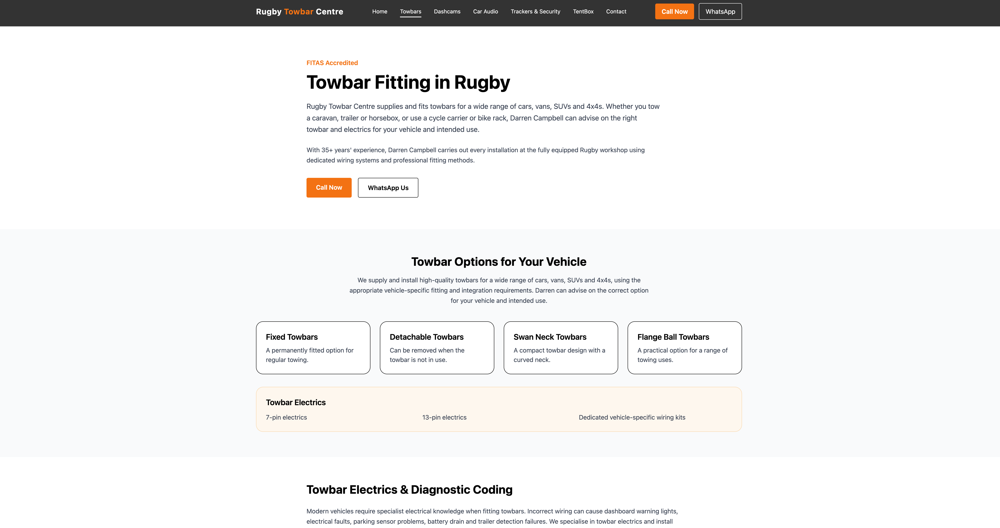
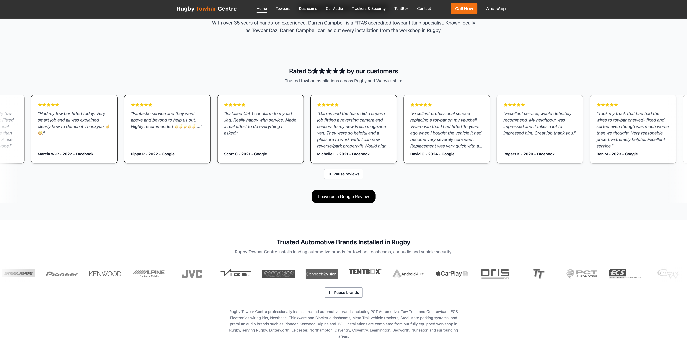
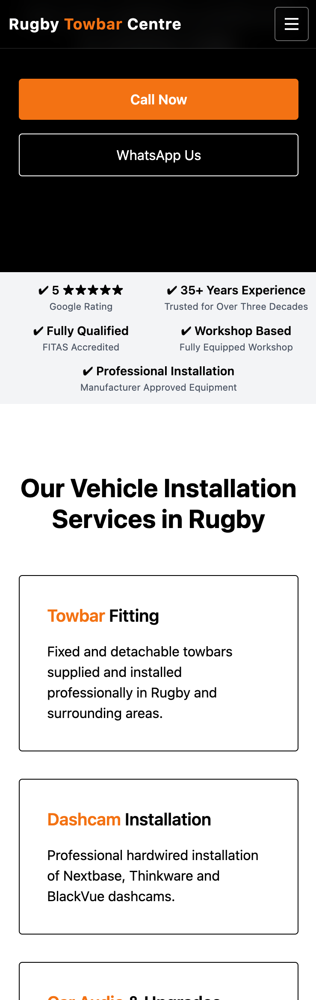

# Rugby Towbar Centre

### Production Website & Local SEO Platform

A production website developed for **Rugby Towbar Centre**, an established vehicle installation specialist based in Rugby, Warwickshire.

The project combines a responsive commercial website with a structured local SEO architecture designed around the company's core services and geographic market.

## Live Website

**https://rugbytowbars.uk**

## Project Screenshots

### Desktop Homepage

### Towbar Fitting Service Page

### Customer Reviews & Automotive Brands

### Responsive Mobile Homepage

---

## The Project

Rugby Towbar Centre required a modern online presence that clearly represented its specialist vehicle installation services while improving the structure and discoverability of the business online.

The website was developed around the company's core services, including towbar fitting, dashcam installation, vehicle trackers and security, car audio installation and TentBox fitting.

A major part of the project involved structuring business, service and location information consistently so that both customers and search engines can understand the business and its services.

## Key Features

- Responsive commercial website
- Dedicated service landing pages
- Towbar fitting service content
- Dashcam installation content
- Vehicle tracker and security services
- Car audio installation
- TentBox fitting
- Click-to-call and WhatsApp contact actions
- Business opening hours and workshop information
- Geographic service-area content
- Customer review presentation
- Brand and accreditation presentation
- Search-engine metadata
- Canonical URLs
- XML sitemap
- Schema.org structured data
- Privacy, cookie, terms and accessibility pages
- Automated unit and end-to-end testing

## Technology

- **Svelte 5**
- **SvelteKit 2**
- **TypeScript**
- **Tailwind CSS 4**
- **Vite**
- **Vitest**
- **Playwright**
- **Cloudflare Workers / Wrangler**

## SEO Architecture

Local search visibility was treated as part of the application architecture rather than simply adding keywords to individual pages.

Business-wide facts such as contact information, location, service areas and website identity are maintained centrally and reused throughout the application.

Dedicated service routes provide focused content for the company's main commercial services.

The application also implements:

- Page-specific titles and descriptions
- Canonical URLs
- Search-engine indexing directives
- XML sitemap generation
- Schema.org structured data
- Local business and automotive repair information
- Geographic service-area information
- Structured service catalogue information

Structured data is generated from the same authoritative application data used by the website, reducing the risk of customer-facing information and search-engine information drifting apart.

The implementation deliberately avoids generating unsupported structured claims when verified information is unavailable.

## Maintainable Business Data

Core business information is separated from page and component logic through a central configuration structure.

This provides a single source for information such as:

- Business identity
- Contact details
- Workshop location
- Opening hours
- Service areas
- Website information
- Social profiles
- SEO defaults

This makes future changes easier to maintain consistently across the website.

## Testing & Deployment

The project includes both unit and end-to-end testing using **Vitest** and **Playwright**.

The production application uses Cloudflare deployment tooling through Wrangler.

The production source repository is maintained privately because this is a commercial client project.

---

## Developed By

**Al Hewitt — BuiltByAl**

Software development, web applications and digital business systems.

**Altheia Pine Labs**
